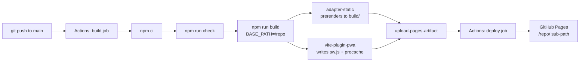

# Deploying SuperCalc CRC to GitHub Pages

This app is **already configured** for GitHub Pages: it prerenders to static
files, rebases its own URLs for a sub-path, and ships an offline-capable service
worker. What remains is to push it to GitHub and switch Pages on.

> **Repository is public — Pages works on the free plan**
>
> GitHub Pages is available for public repositories on **GitHub Free**, so no
> upgrade is needed and **Settings → Pages** will be there straight away.
>
> Two consequences of a public repo worth keeping in mind:
>
> - **Everything you commit is visible to everyone** — source, history, and the
>   contents of `static/`. The deployed bundle is inspectable regardless, so never
>   commit secrets (API keys, tokens, `.env` files); they would be readable in the
>   repo *and* served to the browser.
> - **GitHub Actions minutes are unmetered** for public repositories, so the
>   deploy workflow costs nothing to run.

---

## Table of contents

- [What's already done](#whats-already-done)
- [Step 1 — Verify the build locally](#step-1--verify-the-build-locally)
- [Step 2 — Push the repository to GitHub](#step-2--push-the-repository-to-github)
- [Step 3 — Enable Pages on GitHub](#step-3--enable-pages-on-github)
- [Step 4 — Watch the deploy](#step-4--watch-the-deploy)
- [Step 5 — Verify the live site](#step-5--verify-the-live-site)
- [How the pieces fit together](#how-the-pieces-fit-together)
- [Making changes later](#making-changes-later)
- [Alternative: publishing from a branch](#alternative-publishing-from-a-branch)
- [Troubleshooting](#troubleshooting)
- [Deployment checklist](#deployment-checklist)

---

## What's already done

No code changes are needed — the following is in place and verified:

| Concern | Where | What it does |
| --- | --- | --- |
| Static output | `svelte.config.js` | `@sveltejs/adapter-static` prerenders to `build/` |
| Sub-path support | `svelte.config.js` | `paths.base` reads `BASE_PATH` at build time |
| Deep links | `svelte.config.js` | `fallback: '404.html'` so Pages has a shell for unknown URLs |
| Full prerendering | `src/routes/+layout.ts` | `export const prerender = true` for every route |
| Base-aware links | `+layout.svelte`, `+page.svelte`, `calculator`, `compare` | Internal links use `base` from `$app/paths` |
| Relative manifest | `static/manifest.webmanifest` | `start_url`/`scope`/icons are `./…`, so they survive a sub-path |
| Service worker | `vite.config.ts` | `@vite-pwa/sveltekit` generates a Workbox SW + precache |
| SW registration | `src/lib/components/PwaRegister.svelte` | Registers it from inside the root layout |
| Deploy pipeline | `.github/workflows/deploy.yml` | Type-checks, builds, and publishes on every push to `main` |
| Ignore rules | `.gitignore` | Ignores `build/`/`.svelte-kit/`, un-ignores `.github/workflows/` |

`@sveltejs/adapter-auto` has been removed. It cannot deploy to GitHub Pages: it
only recognises a handful of platforms and emits no static build with a
configurable base path.

---

## Step 1 — Verify the build locally

Prove the output works **before** pushing. The app is served from `/<repo>/` on
Pages, so test it under that same sub-path.

```bash
BASE_PATH=/super npm run build
npm run preview
```

`vite preview` serves the build at `http://localhost:4173/super/`. Open that
exact path — **not** `http://localhost:4173/`, which proves nothing.

Confirm:

- [ ] The page loads with styles and the Inter font applied.
- [ ] `http://localhost:4173/super/calculator` loads on a hard refresh.
- [ ] DevTools → **Application → Service Workers** shows `sw.js` as *activated*.
- [ ] Ticking **Offline** in the Network tab and reloading still renders the app.
- [ ] DevTools → **Application → Manifest** reports no icon or start-URL errors.

> Substitute `/super` with your actual repository name throughout this guide.

---

## Step 2 — Push the repository to GitHub

This repo has **no remote configured yet**, and its local branch is `local-main`.
Rename it to `main` so it matches the workflow trigger, then push.

```bash
cd /Users/juniorlopez/Github/super

# Rename local-main -> main (skip if `git branch --show-current` already says main)
git branch -m local-main main

# Create the public repo and push in one step
# (needs the GitHub CLI: `brew install gh`, then `gh auth login`)
gh repo create super --public --source=. --remote=origin --push
```

<details>
<summary>Prefer to create the repo in the browser instead?</summary>

Create an empty **public** repository named `super` on GitHub, then:

```bash
git remote add origin git@github.com:<your-username>/super.git
git add -A
git commit -m "Add PWA service worker and static adapter for GitHub Pages"
git push -u origin main
```

</details>

A push alone publishes nothing yet — Pages must be switched on first.

---

## Step 3 — Enable Pages on GitHub

The workflow fails with a *"Get Pages site failed"* error until Pages is on.

1. Open the repository on GitHub.
2. Go to **Settings** → **Pages** (in the "Code, planning, and automation" section).
3. Under **Build and deployment** → **Source**, select **GitHub Actions**.
4. Do **not** choose a branch — the workflow publishes the artifact.

Because the repository is public, Pages is enabled on the free plan — if the
**Pages** entry is missing from the sidebar, check that the repo visibility is
still **Public** under **Settings → General → Danger Zone**.

> **Before the first deploy, make sure the repository is actually set to public.**
> `gh repo create --public` handles it, but switching an existing repo is
> **Settings → General → Danger Zone → Change repository visibility**.

Then trigger the first deploy. Either push to `main`:

```bash
git commit --allow-empty -m "Trigger Pages deploy" && git push
```

…or go to the **Actions** tab and run *Deploy to GitHub Pages* manually
(`workflow_dispatch` is enabled for exactly this).

---

## Step 4 — Watch the deploy

In the **Actions** tab, the *Deploy to GitHub Pages* run has two jobs:

- **build** — installs with `npm ci`, runs `npm run check` as a gate, then
  `npm run build` with `BASE_PATH` set to the repo name, and uploads `build/` as
  the Pages artifact. A type error fails the run, so a broken build never
  reaches the live site.
- **deploy** — publishes that artifact and reports the live URL.

First deploys usually take a few minutes. The `deploy` job's summary shows the
`page_url` once it succeeds.

---

## Step 5 — Verify the live site

The site lives at:

```
https://<your-username>.github.io/<repo-name>/
```

For this repo: `https://<your-username>.github.io/super/`.

If you see a **404**, wait a moment — Pages needs a minute after the first
successful deploy to propagate. Then check:

- [ ] The app loads at the full `/<repo>/` path.
- [ ] A **hard refresh** (or a private window) on `/<repo>/calculator` works.
- [ ] Navigating to Compare and Settings works, and Back returns you.
- [ ] DevTools → **Application → Service Workers** shows `sw.js` activated.
- [ ] DevTools → **Application → Manifest** shows the icons with no errors.
- [ ] Ticking **Offline** and reloading still renders the app.
- [ ] The browser offers **Install** (the icon appears in the address bar).

---

## How the pieces fit together



Three details make this work, and each is easy to get wrong:

**1. The base path is injected, not hardcoded.** A project site is served from
`/<repo>/`, not the domain root, so every root-relative URL would 404 without it.
`svelte.config.js` reads `paths.base` from `BASE_PATH`, which the workflow
derives from `github.event.repository.name` — so renaming the repo needs no code
change.

**2. Internal links go through `base`.** SvelteKit rewrites `<a href>` for the
base path automatically, but **`goto()` does not**. The redirects in `+page.svelte`
and `compare/+page.svelte` therefore build their targets from `$app/paths`:

```ts
import { base } from '$app/paths';
void goto(`${base}/calculator`);
```

`goto('/calculator')` would navigate to the domain root and break under a
sub-path.

**3. The manifest is relative.** Files in `static/` are copied verbatim — their
contents are never rewritten. Absolute paths (`"/calculator"`, `"/icons/…"`)
would resolve against the domain root and 404. Relative paths resolve against the
manifest's own URL, which is already base-aware:

```jsonc
"start_url": "./calculator",
"scope": "./",
"icons": [{ "src": "./icons/icon-192.png", … }]
```

### Why the service worker is safe from the base path

The generated `sw.js` registers itself relative to the document, and its precache
entries are relative too — verified in a real build under `/super/`. The cache
resolves to the correct `/<repo>/` scope automatically:

```
Cache Storage: workbox-precache-v2-https://<user>.github.io/super/
  ├── /super/_app/immutable/entry/start.<hash>.js
  ├── /super/calculator
  └── …
```

---

## Making changes later

The pipeline is automatic: commit and push to `main`, and Pages redeploys.

Two behaviours worth knowing:

- **Updates reach installed users automatically.** `registerType: 'autoUpdate'`
  means a new service worker activates and reloads on the next visit — no prompt.
- **Stale caches aren't a risk.** `cleanupOutdatedCaches: true` drops precaches
  from previous builds, so old hashed chunks can't accumulate.
- **Changing the repo name is safe.** `BASE_PATH` is derived from the repo name in
  the workflow, so no code edit is needed. Only a *manual local* build needs the
  new name supplied by hand.

### A note about the service worker in dev

`devOptions.enabled: false` in `vite.config.ts` deliberately disables the service
worker on the dev server — caching localhost causes confusing stale-module
behaviour. This means **`npm run dev` will never show a service worker**, and that
is expected. Always test PWA behaviour against `npm run build && npm run preview`.

---

## Alternative: publishing from a branch

If you'd rather not use Actions, you can publish the build output to a branch
from your own machine. Needs no workflow — see
[`github-pages-manual.md`](./github-pages-manual.md) for the full guide.

The short version:

```bash
npm i -D gh-pages
# package.json:
#   "predeploy": "BASE_PATH=/super npm run build",
#   "deploy": "gh-pages -d build --nojekyll"

npm run deploy
```

Then set **Settings → Pages → Source** to **Deploy from a branch**, branch
`gh-pages`, folder `/ (root)` — and **disable this workflow**, because Pages
publishes from exactly one source and a branch deploy is not the Actions one.

> **Do not use `git subtree push --prefix build origin gh-pages`.** `build/` is in
> `.gitignore` and has never been committed, so `git subtree split` has no tree to
> read and the command fails. Publish from the working tree with the `gh-pages`
> CLI instead.

**Why `--nojekyll` is mandatory here:** GitHub Pages runs Jekyll when publishing
from a branch, and Jekyll ignores any file or folder whose name starts with an
underscore. SvelteKit's entire client bundle lives in `_app/` — so without the
marker you get HTML with no CSS and no JavaScript, and a blank page. This does
**not** apply to the Actions method, which bypasses Jekyll entirely.

---

## Troubleshooting

| Symptom | Likely cause | Fix |
| --- | --- | --- |
| **Pages** missing in Settings | Repo is not public | Set it public under **Settings → General → Danger Zone** (Pages is free for public repos) |
| Workflow: "Get Pages site failed" | Pages not enabled | Step 3 — set Source to **GitHub Actions** |
| Workflow: deploy step denied | Missing `permissions` | Confirm `pages: write` and `id-token: write` in the workflow |
| Blank page, 404s on `/_app/...` | Built without `BASE_PATH` | Rebuild with `BASE_PATH=/<repo>`; confirm it's in the workflow `env` |
| Missing CSS/JS, `_app` 404s | Jekyll stripped `_app/` | Branch method only — add `.nojekyll` to the published folder |
| 404 on refresh or deep link | No fallback generated | Confirm `fallback: '404.html'` in the adapter options |
| `goto()` navigates to the wrong place | Missing `base` prefix | Import `base` from `$app/paths` and prefix the path |
| PWA opens a 404 | Absolute `start_url`/`scope`/icons | Make them relative, per [How the pieces fit together](#how-the-pieces-fit-together) |
| No install prompt, but the app works | Service worker not active | Check DevTools → Application; confirm you tested a **preview** build, not `npm run dev` |
| Worked before, breaks after a deploy | Stale service worker or CDN cache | Hard refresh; `cleanupOutdatedCaches` handles the SW side |
| `npm ci` fails in CI | Lockfile out of sync | Run `npm install` locally and commit `package-lock.json` |
| Site shows an old version | Browser cache | Hard refresh / private window |

---

## Deployment checklist

- [ ] Repository is **public** (Pages is then free to enable).
- [ ] `BASE_PATH=/<repo> npm run build && npm run preview` verified locally,
      including a deep-link refresh.
- [ ] Service worker shows as *activated* and offline mode renders the app.
- [ ] Repository pushed with branch `main`.
- [ ] **Settings → Pages → Source** set to **GitHub Actions**.
- [ ] The Actions run is green and the `deploy` job reports the URL.
- [ ] Live site verified at `https://<user>.github.io/<repo>/`.
- [ ] Install prompt appears, and the installed app opens offline.

---

## Related documentation

- [`readme.md`](./readme.md) — architecture, features, and local development
- [SvelteKit: static site generation](https://svelte.dev/docs/kit/adapter-static)
- [SvelteKit: `paths.base`](https://svelte.dev/docs/kit/configuration#paths)
- [GitHub: configuring a publishing source](https://docs.github.com/en/pages/getting-started-with-github-pages/configuring-a-publishing-source-for-your-github-pages-site)
- [vite-plugin-pwa: SvelteKit](https://vite-pwa-org.netlify.app/frameworks/sveltekit.html)
